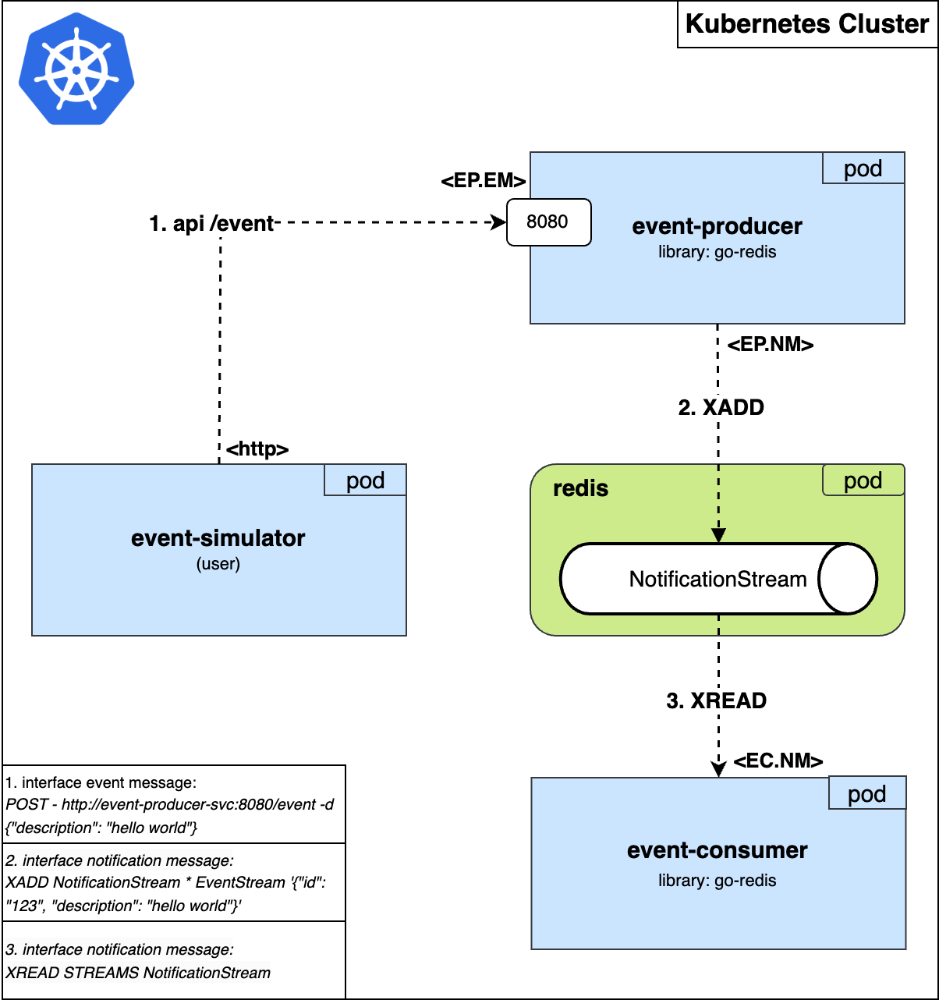
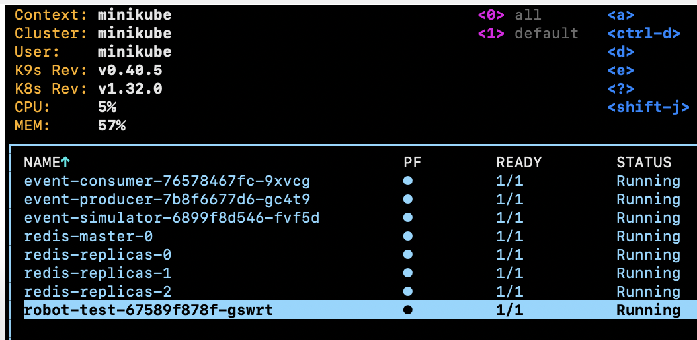

# Introduction

The purpose of this repository is to showcase the end to end lifecycle of microservice development.

**Key points:**

* **Golang** programing language used to develop the microservices. 
* **Robot framework** in addition of **python libraries** to test **functional** and **robustness** test cases.
* **Kubernetes Cluster: Minikube** utilization to deploy the microservices.
* **Docker** to build microservice images which then will be used in the helm chart deployment.
* **Helm** to package the microservices into helm charts that can be easily deployed on the Kubernetes cluster.

# Other Documents

For more internal documents found in **documents/** folder: 

* [Install Guide](documents/installGuide#installation-guide)
  * [Build docker images](documents/installGuide#1-build-docker-images)
  * [Build helm chart](documents/installGuide#2-build-the-helm-chart)
  * [Install helm chart](documents/installGuide#3-installation)
* [Interface Guide](documents/interfaceGuide#interfaces)
  * [Event Message Interface](documents/interfaceGuide#1-event-message-em---interface)
  * [Event Message Interface](documents/interfaceGuide#2-notification-message-nm---interface)
* [Sequence](documents/sequence.md)
* [Swagger](documents/swagger.yaml)

# Deployment

Deployment view of the microservices running in kubernetes cluster.



Pod view of the deployed microservices:




### event-producer microservice interfaces:

| interface name | full name                           | producer           | consumer       |
|----------------|-------------------------------------|--------------------|----------------|
| <EP.EM>        | event-producer.event-message        | application - http | event-producer |
| <EP.NM>        | event-producer.notification-message | event-producer     | event-consumer |

### event-consumer microservice interfaces:

| interface name | full name                           | producer           | consumer       |
|----------------|-------------------------------------|--------------------|----------------|
| <EC.NM>        | event-consumer.notification-message | event-producer     | event-consumer |

The deployment view consists of **4 microservices**.

- 3 microservices in blue (**event-producer**, **event-consumer**, **event-simulator**) which are developed in this repository.
- 1 microservice in green (**redis**) a dependency, which is an **external microservice** found in the following artifactory:
  - https://artifacthub.io/packages/helm/bitnami/redis.

## Description

### Event Producer Microservice

The **event-producer microservice** consists of 2 interfaces and has a dependency on the redis microservice.

- The Event Message (EM) interface and the Notification Message (NM) interface.

- The event-producer has a client connection to the redis microservice using the following dependency:
  - github.com/redis/go-redis/v9
  
- The usecase of the redis client connection is to create a redis stream called NotificationStream.
  - Stream created on:
       1. Start up.
       2. Pod restart.
       3. If the client connection has been lost. 
- Another usecase of the redis client is to send events to the redis stream using the Notification Message interface.
The event sent to the redis stream is defined by the Notification Message interface and consists of the following data
`{"id": 123, "description": "hello world", "timestamp": "2025-02-25T22:06:25.478310425Z"}`. This event is sent to redis
when a http request is sent to the `/event` endpoint defined by the Event Message (EM) interface. 


### Event Consumer Microservice

The **event-consumer microservice** implements the Notification Message (NM) interface and has a dependency on the redis microservice.

- The event-consumer has a client connection to the redis microservice using the following dependency:
  - github.com/redis/go-redis/v9

- The usecase for this redis client connection is to consume an event from the redis stream generated by the event-producer microservice.
The event consumed will look like this `{"id": 123, "description": "hello world", "timestamp": "2025-02-25T22:06:25.478310425Z"}` as defined
by the Notification Message (NM) interface. When a Notification Message is consumed from the redis stream it is unmarshalled, logged and then acknowledged. 


### Event Simulator Microservice - (traffic simulator)

The **event-simulator microservice** is optional, It's used to **simulate user traffic** to the Event Message (EM) interface.
- You can use curl to send a http requests to the Event Message (EM) interface instead.

### Redis Microservice - (external microservice)

The **redis microservice** is a dependency service used by **event-producer microservice** and the **event-consumer microservice**.
The redis stream feature is utilized.

## Project structure

```
├── chart                               # MASTER HELM CHART
│   ├── charts                            # helm build artifacts (generated)
│   │   ├── event-consumer-0.0.1.tgz      # helm artifact generated from folder event-consumer/chart 
│   │   ├── event-producer-0.0.1.tgz      # helm artifcat generated from folder event-producer/chart 
│   │   ├── event-simulator-0.0.1.tgz     # helm artifcat generated from folder event-simulator/chart
│   │   └── redid-20.7.0.tgz              # helm artificat based on bitnami/redis --version 20.7.0
│   ├── Chart.yaml                        #
│   └── values.yaml                       #
├── documents                           # DOCUMENTATION
│   ├── images                            #
│   ├── sequence                          #
│   │   └── sequence.puml                 #
│   ├── installGuide.md                   #
│   ├── interfaceGuide.md                 #
│   ├── sequence.md                       #
│   └── swagger.yaml                      #
├── event-consumer                      # MICROSERVICE - event-consumer
│   ├── chart                             # helm chart artifacts
│   │   ├── templates                     #
│   │   │   └── deployment.yaml           #
│   │   ├── Chart.yaml                    #
│   │   └── values.yaml                   #
│   ├── docker                            #
│   │   └── Dockerfile                    # docker file
│   ├── src                               # golang event-consumer code folder
│   │   ├── {other go package folders}    # go package folders
│   │   ├── go.mod                        #
│   │   └── main.go                       # go main file
├── event-producer                      # MICROSERVICE - event-producer
│   ├── chart                             # helm chart artifacts
│   │   ├── templates                     #
│   │   │   └── deployment.yaml           #
│   │   ├── Chart.yaml                    #
│   │   └── values.yaml                   #
│   ├── docker                            #
│   │   └── Dockerfile                    # docker file
│   └── src                               # golang event-producer code folder
│   │   ├── {other go package folders}    # go package folders
│   │   ├── go.mod                        #
│   │   └── main.go                       # go main file
├── event-simulator                     # MICROSERVICE - event-simulator
│   ├── chart                             # helm chart artifacts
│   │   ├── templates                     #
│   │   │   └── deployment.yaml           #
│   │   ├── Chart.yaml                    #
│   │   └── values.yaml                   #
│   ├── docker                            #
│   │   └── Dockerfile                    # docker file
│   └── src                               # golang event-simulator code folder
│   │   ├── {other go package folders}    # go package folders
│   │   ├── go.mod                        #
│   │   └── main.go                       # go main file
├── robot-test                          # ROBOT TEST FRAMEWORK
│   ├── chart                             # helm chart artifacts
│   │   ├── templates                     #
│   │   │   ├── clusterRoles.yaml         #
│   │   │   └── deployment.yaml           #
│   │   ├── Chart.yaml                    #
│   │   └── values.yaml                   #
│   ├── docker                            #
│   │   └── Dockerfile                    # docker file
│   ├── tests                             #
│   │   ├── python_library                # other python files
│   │   ├── robot_resource                # other robot files
│   │   ├── test_functional.robot         # runnable functional tests
│   │   └── test_robustness.robot         # runnable robusteness tests
├── application-1.0.0.tgz               # MASTER HELM CHART ARTIFACT
└── README.md
```
